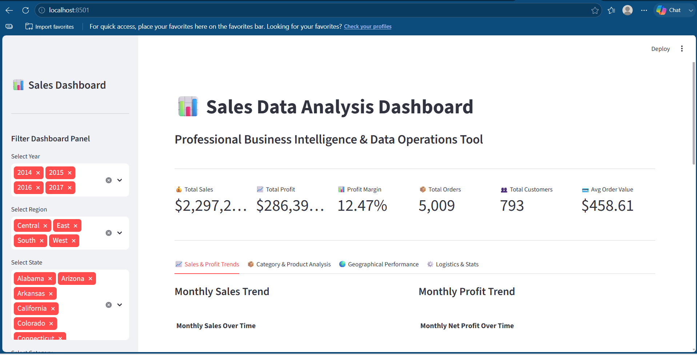
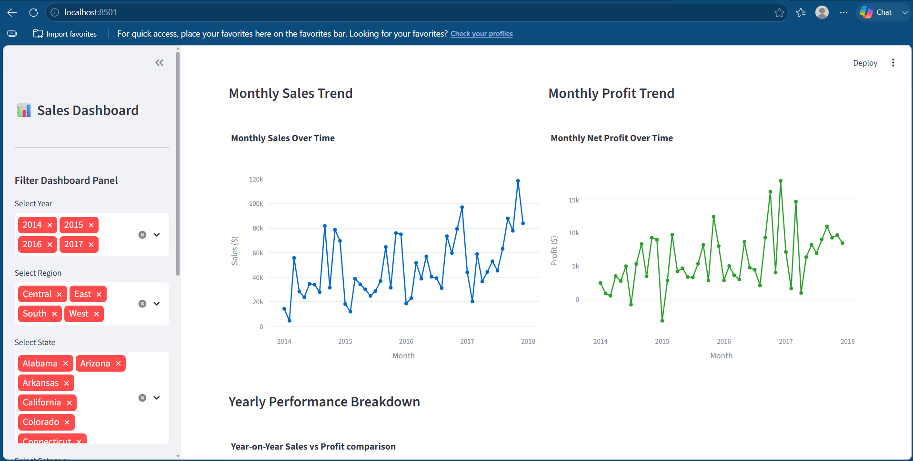
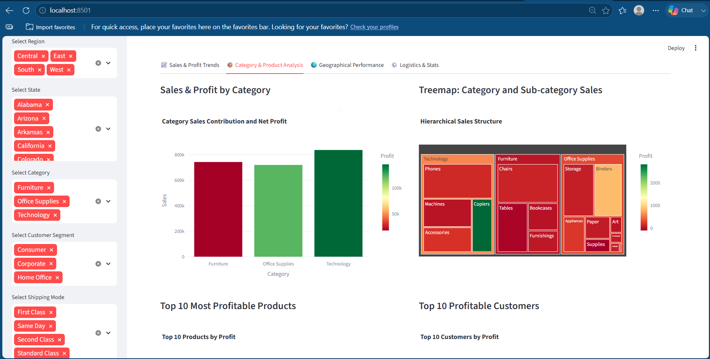
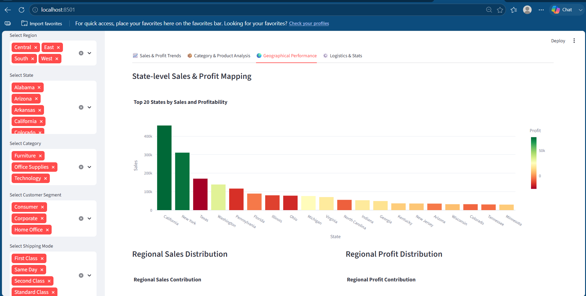
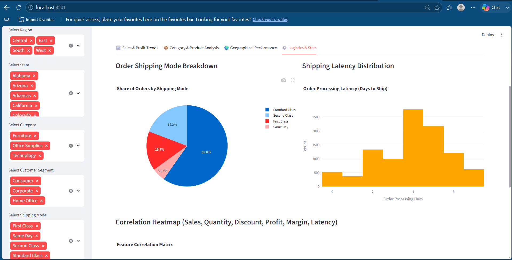

# 📊 Sales Data Analysis Dashboard | Python • Streamlit • EDA • Business Intelligence


An end-to-end **Sales Data Analysis Dashboard** built using **Python, Pandas, NumPy, Matplotlib, Seaborn, Plotly, and Streamlit**. This project analyzes the **Sample Superstore** dataset to uncover sales trends, profitability, customer behavior, and business insights through Exploratory Data Analysis (EDA) and an interactive dashboard.

---

# 📌 Project Overview

This project demonstrates a complete data analytics workflow, including:

- Data Cleaning & Preprocessing
- Feature Engineering
- Exploratory Data Analysis (EDA)
- Statistical Analysis
- Business KPI Analysis
- Interactive Streamlit Dashboard
- Business Insights & Recommendations

The dashboard enables users to explore sales performance using interactive filters and visualizations, helping identify profitable opportunities and business improvement areas.

---

# 🎯 Business Problem

Retail businesses generate large volumes of sales data every day, but raw data alone cannot support effective business decisions.

The objective of this project is to answer important business questions such as:

- Which regions generate the highest sales and profit?
- Which product categories perform the best?
- How do discounts affect profitability?
- Which states and cities are underperforming?
- Which customer segments contribute the most revenue?
- How do sales and profits change over time?

---

# 🚀 Project Features

### ✔ Data Processing

- Data Cleaning
- Missing Value Analysis
- Duplicate Removal
- Date Conversion
- Feature Engineering

### ✔ Exploratory Data Analysis

- Sales Analysis
- Profit Analysis
- Category Analysis
- Sub-Category Analysis
- Customer Segment Analysis
- Region Analysis
- State Analysis
- Shipping Mode Analysis
- Discount Analysis
- Correlation Analysis
- Outlier Detection

### ✔ Interactive Dashboard

- Sidebar Filters
- KPI Cards
- Monthly Sales Trend
- Monthly Profit Trend
- Product Analysis
- Regional Performance
- Logistics Analysis
- Interactive Plotly Visualizations

---

# 🛠 Tech Stack

### Programming Language

- Python

### Libraries

- Pandas
- NumPy
- Matplotlib
- Seaborn
- Plotly
- Streamlit
- SciPy
- Statsmodels

### Tools

- Jupyter Notebook
- VS Code
- Git
- GitHub

---

# 📁 Project Structure

```text
Sales_Data_Analysis/
│
├── Sales_Data_Analysis.ipynb
├── app.py
├── requirements.txt
├── README.md
├── .gitignore
├── Sample - Superstore.csv
└── Screenshots/
    ├── dashboard_home.png
    ├── sales_trend.png
    ├── category_analysis.png
    ├── regional_analysis.png
    └── logistics_analysis.png
```

---

# 📸 Dashboard Preview

## 🏠 Dashboard Home

> Replace the image below with **dashboard_home.png**



---

## 📈 Sales & Profit Trend

> Replace the image below with **sales_trend.png**



---

## 📦 Category & Product Analysis

> Replace the image below with **category_analysis.png**



---

## 🌍 Regional Performance

> Replace the image below with **regional_analysis.png**



---

## 🚚 Logistics & Statistical Analysis

> Replace the image below with **logistics_analysis.png**



---


# 📊 Key Business Metrics

| Metric | Value |
|--------|-------:|
| Total Sales | **$2,297,200.86** |
| Total Profit | **$286,397.02** |
| Profit Margin | **12.47%** |
| Total Orders | **5,009** |
| Total Customers | **793** |
| Average Order Value | **$458.61** |

---

# 💡 Key Insights

- Higher discount percentages negatively impact profitability.
- Technology products generate higher profits than Furniture.
- Texas and Ohio are among the least profitable states.
- Tables are one of the least profitable product sub-categories.
- Sales peak during the fourth quarter, especially in November and December.
- Regional performance varies significantly across different states and customer segments.

---

# 🔮 Future Enhancements

- Sales Forecasting using Time Series Models
- Customer Segmentation using RFM Analysis
- Machine Learning-based Sales Prediction
- Automated Business Reports
- Streamlit Cloud Deployment
- Power BI Dashboard Integration

---

# ⚙ Installation

Clone the repository

```bash
git clone <your-github-repository-url>
```

Move into the project folder

```bash
cd Sales_Data_Analysis
```

Install dependencies

```bash
pip install -r requirements.txt
```

---

# ▶ Usage

### Run the Jupyter Notebook

```bash
jupyter notebook Sales_Data_Analysis.ipynb
```

### Run the Streamlit Dashboard

```bash
streamlit run app.py
```

The dashboard will open automatically in your browser:

```text
http://localhost:8501
```

---

# 📈 Results

This project provides:

- Interactive Business Dashboard
- Business KPI Monitoring
- Sales Performance Analysis
- Customer Insights
- Regional Performance Analysis
- Product Performance Analysis
- Discount Impact Analysis
- Actionable Business Recommendations

---

# 👩‍💻 Author

**Astha Nishad**

B.Tech CSE (Data Science)

GitHub:
https://github.com/Asthanishad

LinkedIn:
https://www.linkedin.com/in/astha-nishad-b10379329/

---

# 📄 License

This project is created for educational and portfolio purposes.